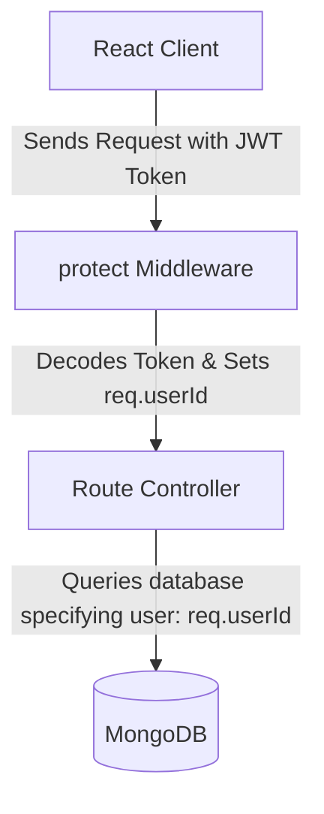

# 🪙 Xpensify — Premium Personal Finance Tracker

Xpensify is a state-of-the-art, premium personal finance tracker designed to help users take complete control of their financial life. Featuring sleek dark modes, interactive HSL-tailored charts, budget limits, secure OTP-backed authentication, and deep analytics, Xpensify turns personal budgeting into an elegant experience.

---

## 🚀 Quick Start & Running Locally

Ensure you have **Node.js** and **MongoDB** running locally.

### 1. Database Prerequisite
MongoDB must be active on your machine. The default URI is:
```bash
mongodb://127.0.0.1:27017/xpensify
```

### 2. Setup Environment Variables
Create a `.env` file inside the `backend/` directory:
```env
PORT=5000
MONGO_URI=mongodb://127.0.0.1:27017/xpensify
JWT_SECRET=your_super_secure_jwt_secret_key
JWT_EXPIRE=30d

# SMTP Mail configuration (for OTP password recovery)
SMTP_HOST=smtp.gmail.com
SMTP_PORT=587
SMTP_USER=dhruvkanpariya706@gmail.com
SMTP_PASS=your-16-character-app-password
SMTP_FROM=Xpensify <dhruvkanpariya706@gmail.com>
```

### 3. Run Frontend & Backend Concurrently
From the root directory, install dependencies and start both servers simultaneously:
```bash
# Install root dependencies
npm install

# Install backend dependencies
cd backend && npm install && cd ..

# Start both servers together
npm run dev:full
```
* **Frontend Dev Server**: `http://localhost:5173`
* **Backend API Server**: `http://localhost:5000`

---

## 🛠️ Technology Stack Overview

| Category | Technology |
|----------|------------|
| **Frontend Core** | React 18 (JavaScript) + Vite |
| **Styling & UI** | Tailwind CSS v3.4 + Vanilla CSS customization + shadcn/ui |
| **Routing** | React Router DOM v7 |
| **Interactive Charts** | Recharts (dynamic animations & custom tooltips) |
| **Authentication** | Secure JWT Auth + OTP Mailers (Nodemailer) |
| **State Managers** | React Context (AuthContext, MonthContext, ThemeContext) |
| **Forms & Specs** | React Hook Form + Zod Schema Validation |
| **Backend Core** | Node.js + Express.js + Mongoose (MongoDB) |

---

## 🔒 User-Scoped Security & Database Architecture

Every piece of data stored in **Xpensify** is strictly secured and scoped. Users can only view, create, edit, or delete items belonging to their authenticated session.



### 1. Database Model Isolation
Every document schema contains a strict foreign key reference to the authenticated `User`:
* **Transactions (`backend/models/Transaction.js`)**:
  ```javascript
  user: { type: mongoose.Schema.Types.ObjectId, ref: 'User', required: true }
  ```
* **Budgets (`backend/models/Budget.js`)**:
  ```javascript
  user: { type: mongoose.Schema.Types.ObjectId, ref: 'User', required: true }
  ```
  *(Features a compound unique index `{ user: 1, month: 1, year: 1 }` preventing multi-budget collisions).*

### 2. Controller Scoping
Every database action specifies `{ user: req.userId }`. Even if a hacker attempts to guess or brute-force a transaction ID, the backend will return a `404 Not Found` or `401 Unauthorized` if the record does not match the logged-in user:
```javascript
const transaction = await Transaction.findOne({ _id: req.params.id, user: req.userId });
```

---

## 📊 Elite Interactive Dashboard Analytics

The financial dashboards have been heavily redesigned to prioritize modern, high-fidelity SaaS aesthetics:

### 📈 Dynamic Spending Trends (`SpendingChart.jsx`)
* **Fully Opaque Vibrant Gradients**: Visualizes cashflow with custom linear SVG color gradients.
  * **Income**: Emerald Green to Forest Green (`#10B981` ➔ `#059669`).
  * **Expense**: Vibrant Rose to Crimson Red (`#F43F5E` ➔ `#E11D48`).
* **Savings Badges**: Built-in `CustomTooltip` displays details along with a real-time **Savings Rate** (e.g. `+40%` or `-12%`) with context-aware color states.
* **Filter Transition Loading**: Overhauls filter switches (Week, Month, Year). Whenever the user changes the timeframe or selected month, a sleek loading skeleton displays for `450ms` before unrolling beautiful bar-chart entry animations from zero.

### 🍩 Bi-directional Interactive Donuts (`CategoryChart.jsx`)
* **Shared Hover States**: Hovering over the Donut segment expands it AND highlights the corresponding category list card below. Hovering over a list card highlights the Donut segment.
* **Center Display Overlay**: The empty center of the donut chart displays:
  * *Default*: Your overall **Total Expense** for the timeframe.
  * *Hover*: The **Category Name**, spent amount, and exact **percentage representation** of your total monthly expenditures.
* **Category Progress Trackers**: Each category listed displays its relative budget/spent share with smooth colored status-bar fills matching the chart colors.

---

## ✉️ SMTP Setup Guide (Nodemailer)

To support OTP generation for Forgot Password flows, configure your email credentials in `backend/.env`.

### Gmail Setup (Recommended)
1. Go to your [Google Security Account page](https://myaccount.google.com/apppasswords).
2. Create an **App Password**:
   * **App**: Select "Mail".
   * **Device**: Select "Other (Custom Name)" and type "Xpensify".
3. Click **Generate** and copy the 16-character pass-code (e.g. `abcd efgh ijkl mnop`).
4. Strip the spaces and paste it as `SMTP_PASS` into `backend/.env`:
   ```env
   SMTP_HOST=smtp.gmail.com
   SMTP_PORT=587
   SMTP_USER=dhruvkanpariya706@gmail.com
   SMTP_PASS=abcdefghijklmnop
   SMTP_FROM=Xpensify <dhruvkanpariya706@gmail.com>
   ```

### Other Providers
| Provider | SMTP Host | Port |
|---|---|---|
| **Outlook** | `smtp.office365.com` | `587` |
| **Yahoo** | `smtp.mail.yahoo.com` | `587` |
| **Zoho** | `smtp.zoho.com` | `587` |

---

## ✅ Implementation Checklist & Milestone History

- **Phase 1: Backend Architecture ✅**
  - [x] Establish Express.js environment, Nodemon dev tools, and secure routing
  - [x] Formulate MongoDB Schemas for `User`, `Transaction`, and `Budget`
  - [x] Configure token validation JWT middlewares (`auth.js`)
  - [x] Build SMTP Mailer module with transactional email support

- **Phase 2: Frontend Redesign & Contexts ✅**
  - [x] Develop global providers: `AuthContext`, `MonthContext`, `ThemeContext`
  - [x] Replace `.tsx` wrappers with responsive `.jsx` counterparts
  - [x] Secure private page routes via authenticated redirects
  - [x] Build multi-timeframe analytics toggles (Week, Month, Year)

- **Phase 3: High-Fidelity UI Redesigns ✅**
  - [x] Overhaul `SpendingChart` custom gradient configurations
  - [x] Code interactive center-content overlays for `CategoryChart` donut segments
  - [x] Implement synced hover triggers across graphs and legend cards
  - [x] Set up beautiful local unmount loading skeleton systems

---

## 📂 Project Structure

```
xpensify/
├── backend/
│   ├── config/             # Database connection utilities
│   ├── middleware/         # protect Auth and error handlers
│   ├── models/             # Mongoose Schemas (User, Transaction, Budget)
│   ├── routes/             # REST routing (auth, transactions, budgets)
│   ├── utils/              # Emailer modules and helpers
│   ├── .env                # Server configurations (ignored by git)
│   └── server.js           # Main Express server entry point
├── public/                 # Static public assets
└── src/
    ├── components/
    │   ├── ui/             # Reusable UI widgets
    │   ├── layout/         # Header sidebar and page wrappers
    │   └── dashboard/      # SpendingChart, CategoryChart, StatCard
    ├── context/            # Context state managers (Auth, Month, Theme)
    ├── lib/                # API controllers, axios clients, constants
    ├── pages/              # Auth forms, Dashboard, Analytics, Budgets
    ├── App.jsx             # React routing setup
    ├── main.jsx            # DOM mounting entry
    └── index.css           # Global custom classes & Tailwind base
```
